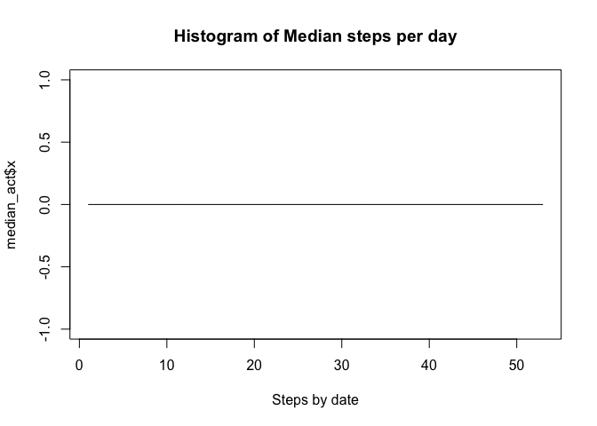
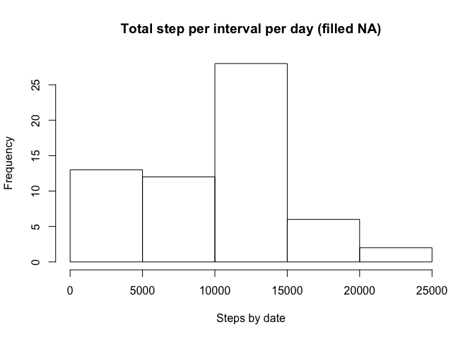

First project of reproducible reserch course week 2 by Rodrigo Tintor


## Loading and preprocessing the data


```r
activity <- read.csv("activity.csv", na.strings = "NA")
activityOutNA <- activity[!is.na(activity["steps"]),]
activityOutNA["date"] = as.Date(activityOutNA$date)
```

```
## Warning in strptime(xx, f <- "%Y-%m-%d", tz = "GMT"): unknown timezone
## 'zone/tz/2017c.1.0/zoneinfo/America/Mexico_City'
```

```r
summary(activityOutNA)
```

```
##      steps             date               interval     
##  Min.   :  0.00   Min.   :2012-10-02   Min.   :   0.0  
##  1st Qu.:  0.00   1st Qu.:2012-10-16   1st Qu.: 588.8  
##  Median :  0.00   Median :2012-10-29   Median :1177.5  
##  Mean   : 37.38   Mean   :2012-10-30   Mean   :1177.5  
##  3rd Qu.: 12.00   3rd Qu.:2012-11-16   3rd Qu.:1766.2  
##  Max.   :806.00   Max.   :2012-11-29   Max.   :2355.0
```

```r
head(activityOutNA)
```

```
##     steps       date interval
## 289     0 2012-10-02        0
## 290     0 2012-10-02        5
## 291     0 2012-10-02       10
## 292     0 2012-10-02       15
## 293     0 2012-10-02       20
## 294     0 2012-10-02       25
```

## What is mean total number of steps taken per day?


```r
total_act <- aggregate(x = activityOutNA$steps, FUN = sum, by = list(activityOutNA$date))
mean_act <- aggregate(x = activityOutNA$steps, FUN = mean, by = list(activityOutNA$date))
median_act <- aggregate(x = activityOutNA$steps, FUN = median, by = list(activityOutNA$date))
hist(total_act$x, xlab = "Steps by date", main = "Histogram of total steps per day")
```

<!-- -->

```r
plot(mean_act$x, type = "l", xlab = "Steps by date", main = "Histogram of Mean steps per day")
```

<!-- -->

```r
plot(median_act$x, type = "l", xlab = "Steps by date", main = "Histogram of Median steps per day")
```

<!-- -->

## What is the average daily activity pattern?


```r
total_act_time <- aggregate(x = activityOutNA$steps, FUN = sum, by = list(activityOutNA$interval))
plot(total_act_time$Group.1, total_act_time$x, type = "l", xlab = "Interval", ylab = "Steps", main = "Average step per interval per day")
```

<!-- -->

```r
print(paste("Interval with max steps: ", as.character(total_act_time[which.max(total_act_time$x),1])))
```

```
## [1] "Interval with max steps:  835"
```

## Imputing missing values
Missing values by column


```r
naNumbers <- colMeans(is.na(activity)) * 100
naNumbers[naNumbers > 0]
```

```
##    steps 
## 13.11475
```

For missing values we will use the median of the same interval


```r
median_act_inter <- aggregate(x = activityOutNA$steps, FUN = median, by = list(activityOutNA$interval))
activityNA <- activity[is.na(activity["steps"]),]
activityNA["date"] = as.Date(activityNA$date)
activityNA$steps <- median_act_inter$x[match(activityNA$interval, median_act_inter$Group.1)]

activityNoNA <- rbind(activityOutNA, activityNA)

total_act_f <- aggregate(x = activityNoNA$steps, FUN = sum, by = list(activityNoNA$date))
mean_act_f <- aggregate(x = activityNoNA$steps, FUN = mean, by = list(activityNoNA$date))
median_act_f <- aggregate(x = activityNoNA$steps, FUN = median, by = list(activityNoNA$date))
hist(total_act_f$x, , xlab = "Steps by date", main = "Total step per interval per day (filled NA)")
```

<!-- -->

```r
plot(mean_act_f$x,type = "l", xlab = "Steps by date", main = "Mean step per interval per day (filled NA)")
```

<!-- -->

```r
plot(median_act_f$x, type = "l", xlab = "Steps by date", main = "Median step per interval per day (filled NA)")
```

<!-- -->

## Are there differences in activity patterns between weekdays and weekends?


```r
w1 <- weekdays(activityNoNA$date, abbreviate = TRUE)
w2 <- w1=="Sat" | w1 =="Sun"
week <- factor(w2, labels = c("weekday","weekend"))
activityNoNA["daytype"] <- week
activityNoNAWD <- subset(activityNoNA ,daytype=="weekday")
activityNoNAWE <- subset(activityNoNA ,daytype=="weekend")
mean_act_f2 <- aggregate(x = activityNoNAWD$steps, FUN = mean, by = list(activityNoNAWD$interval))
par(mfrow = c(2,1))
plot(mean_act_f2$Group.1, mean_act_f2$x, type = "l", xlab = "Interval", ylab = "Steps", main = "Average step per interval per weekday")
mean_act_f3 <- aggregate(x = activityNoNAWE$steps, FUN = mean, by = list(activityNoNAWE$interval))
plot(mean_act_f3$Group.1, mean_act_f3$x, type = "l", xlab = "Interval", ylab = "Steps", main = "Average step per interval per weekend")
```

<!-- -->

Thanks in advance for your comments
Rodrigo

